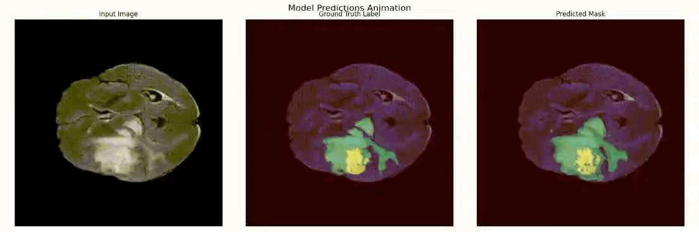

# Comparative Analysis of Deep Learning Models for Multi-Modal Brain Tumor Segmentation

This repository contains the code and resources for the Deep Learning project titled "Comparative Analysis of Deep Learning Models for Multi-Modal Brain Tumor Segmentation".

## Introduction
Brain tumor segmentation is a crucial process in medical image analysis, enabling the identification and delineation of tumor regions in brain scans. This project aims to compare various deep learning models for multi-modal brain tumor segmentation.

## Dataset
The dataset used for this project is the BraTS 2021 multi-modal brain tumor dataset, which includes various imaging modalities such as T1, T2, FLAIR, and T1Gd.

## Models
The following deep learning models are compared in this project:
- LSTM-UNET Model
- Transfomer Based Model
- U-Net Model

## Results
Detailed results can be found in the corresponding Jupyter notebooks.

## Usage
To run the experiments and reproduce the results, follow these steps:

1. Clone the repository:
    ```bash
    git clone https://github.com/yusufkaramustafa/Brain-Tumor-Segmentation.git
    ```
2. Navigate to the project directory:
    ```bash
    cd Brain-Tumor-Segmentation
    ```
3. Install the required packages:
    ```bash
    pip install -r requirements.txt
    ```
4. Open the Jupyter notebooks and run the code:
    ```bash
    jupyter notebook
    ```
## References
Transformer Model:
```bibtex
@misc{wang2021transbtsmultimodalbraintumor,
      title={TransBTS: Multimodal Brain Tumor Segmentation Using Transformer}, 
      author={Wenxuan Wang and Chen Chen and Meng Ding and Jiangyun Li and Hong Yu and Sen Zha},
      year={2021},
      eprint={2103.04430},
      archivePrefix={arXiv},
      primaryClass={cs.CV},
      url={https://arxiv.org/abs/2103.04430}, 
}
```
LSTM-UNET Model:
```bibtex
@INPROCEEDINGS{8981027,
  author={Xu, Fan and Ma, Haoyu and Sun, Junxiao and Wu, Rui and Liu, Xu and Kong, Youyong},
  booktitle={2019 IEEE 4th International Conference on Image, Vision and Computing (ICIVC)}, 
  title={LSTM Multi-modal UNet for Brain Tumor Segmentation}, 
  year={2019},
  volume={},
  number={},
  pages={236-240},
  keywords={multi modalities images;image segmentation;UNet;LSTM;deep learning},
  doi={10.1109/ICIVC47709.2019.8981027}}

```
U-Net Model:
```bibtex
@misc{fridman2023multiclass,
  author       = {Naomi Fridman},
  title        = {Multi-class Image Segmentation},
  year         = {2019},
  url          = {https://naomi-fridman.medium.com/multi-class-image-segmentation-a5cc671e647a},
}
```
